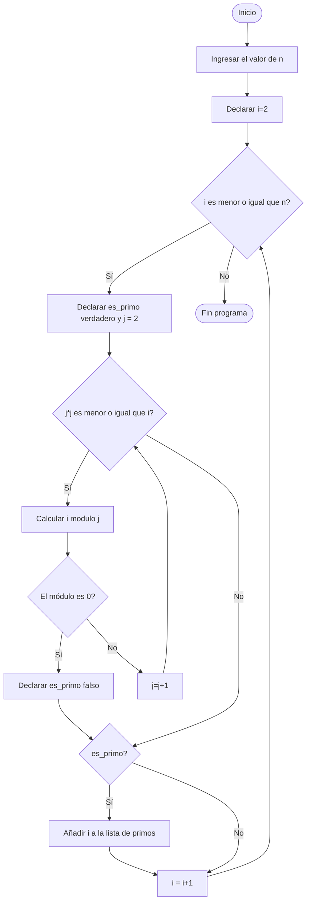

# Reto 3 

En este repositorio se muestra un pseudocódigo para obtener los números primos hasta n

```pseudocode
[variables]
  primos : lista de enteros
  n : entero
  i, j : enteros

primos := []
i := 2

Mientras (i <= n) hacer
  es_primo := verdadero
  j := 2
  Mientras (j * j <= i) hacer
    Si modulo(i, j) == 0
      Entonces es_primo := falso
      Romper
    sino
      j := j + 1
  Fin mientras
  Si es_primo
    Entonces añadir i a la lista de primos
  i := i + 1
Fin mientras
```

La representación gráfica de este algoritmo usando un diagrama de flujo se muestra a continuación


